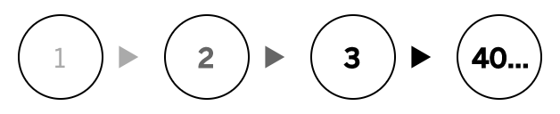
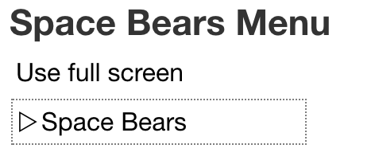
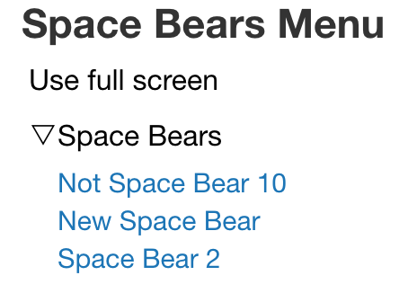
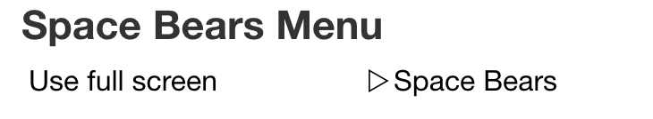
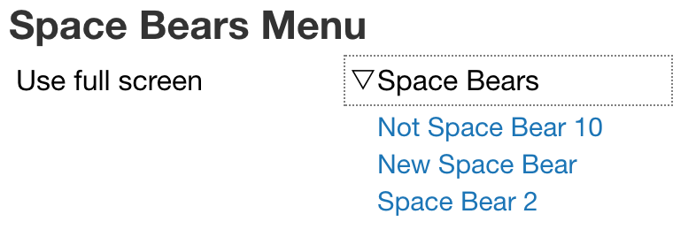
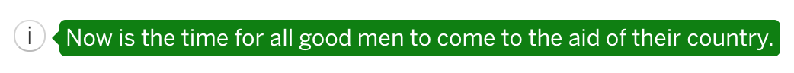
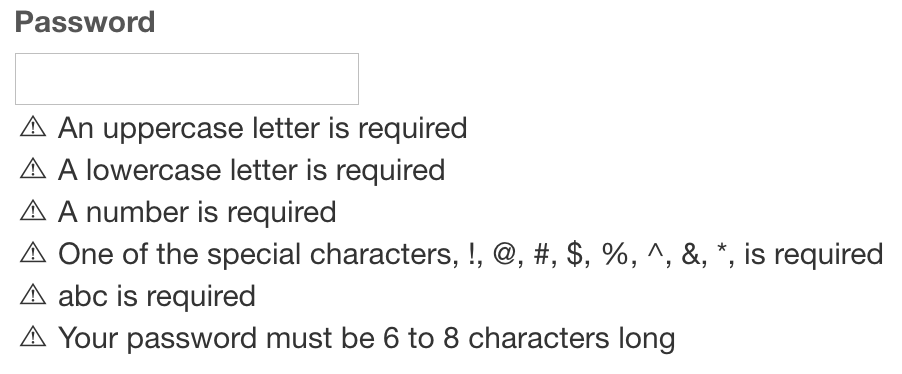
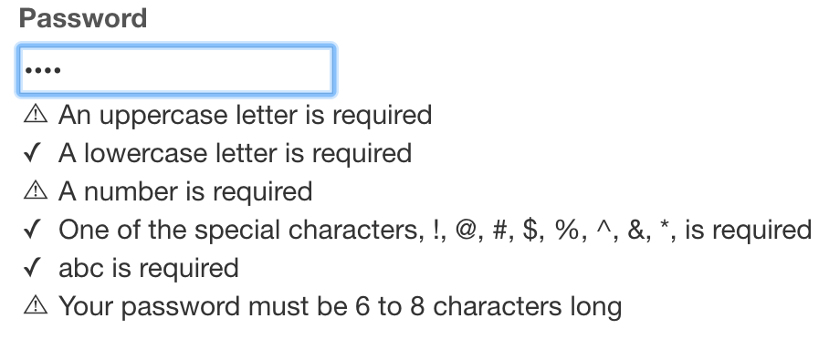

# reactjs
ReactJs components

These ReactJs components are all built with accessibility in mind and implement the best practice consenus from experts
in the field of web accessibility.

## Components
* [Accordion](#Accordion)
* [AlertDialog](#AlertDialog)
* [Breadcrumb](#Breadcrumb)
* [Calendar](#Calendar)
* [Carousel](#Carousel)
* [Dialog](#Dialog)
* [Grid](#Grid)
* [Menu](#Menu)
* [Modal](#Modal)
* [ProgressBar](#ProgressBar)
* [Slider](#Slider)
* [Tabs](#Tabs)
* [Toolbar](#Toolbar)
* [Tooltip](#Tooltip)
* [Tree](#Tree)
* [ValidatingInput](#ValidatingInput)
* [Video](#Video)

## Accordion
An `Accordion` is a widget that expands and collapses when the header is activated.

### Attributes
* expanded: Whether or not the content is expanded by default
* id: The identifier of the object
* label: The header to use when displaying the accordion

### Example
```
<Accordion label="Political Rhetoric">
  <p>
    Now is the time for all good men to come to the aid of their country.
  </p>
  <p>
    Ask not what your country can do for you. Ask what you can do for your country.
  </p>
</Accordion>
```

## AlertDialog
An `AlertDialog` is an application window that is designed to interrupt the current processing of an application in order to display an alert message.

### Attributes
* label: The header to display.
* lang: The BCP-47 language code. It defaults to 'en'.
* onClose: The ECMAScript function to run when the dialog is dismissed. Two arguments are passed into the `onClose` function: the AlertDialog instance and the event that was passed into the `close` method.

### Properties
* children {ReactJsElement[]} The content displayed in the body of the AlertDialog.
* label {string} The header to display.
* lang {string} The BCP-47 language code; default is 'en'.
* html {string} The HTML of the AlertDialog

### Example
```
const log = (alertDialog, e) => {
  const {
    target,
  } = e;
  console.log(alertDialog.html);
  switch (target.id) {
    case 'btnContinue':
      window.location.reload();
      break;
    case 'btnCancel':
      break;
  }
};

<AlertDialog id="system-failure" label="Warning - Total System Failure" onClose={this.log}>
  <p>
    The system has experienced a catastrophic failure. Select 'Continue'
    to reboot, or 'Cancel' to shutdown.
  </p>
  <div className="controls" role="group">
    <button id="btnContinue">Continue</button>
    <button id="btnCancel">Cancel</button>
  </div>
  <footer>
   <p>This is a footer where we put &copy; 2018</p>
  </footer>
</AlertDialog>
```

## Breadcrumb
A `Breadcrumb` is an element that displays the progress status for tasks dependent on user interaction, e.g., paying for an item. Crumbs are rendered as a group inside a container with the 'breadcrumbs' class. The special class, `by-index` will render the breadcrumbs using the numeric index.

#### Breadcrumbs with default styles




### Attributes
* index: The index of the active item.

### Example
```
<Breadcrumbs aria-label="Breadcrumbs" id="trail" index={2}>
  <a href="/">Home</a>
  <a href="/libraries/">Libraries</a>
  <a href="/libraries/js/">JavaScript</a>
</Breadcrumbs>
``` 

## Calendar
One of the most difficult things to make accessible is the interface we call "datepicker". A "datepicker" is composed of
two interfaces - an input that allows the user to enter a date and a calendar interface that allows the user to select
a date. This calendar was originally built as the calendar interface portion of a datepicker. Note - if you are looking
for the AngularJs version that was the basis of this component, you can find that at https://github.com/hrobertking/angular/blob/master/ng-calendar/ng-calendar.js.

### Attributes
* classList: A string of classes to apply to the component, e.g., "parent-teacher conference"
* defaultValue: A default value in ISO 8601 format, e.g., "2018-02-28".
* hint: A message to display after the calendar in the table footer.
* highlights: An array of objects that list a date `value` and a string `type`, e.g., `highlights={[{ type: 'closed', '2018-01-01' },{ type: 'holiday', value: '2018-02-14' }, { type: 'holiday': '2018-03-17' }]}`.
* info: A status message to display at the end of the table used to display the calendar.
* lang: A BCP 47 language tag for month and day names. The default is 'en'.
* legend: An object array each with `type`, `description`; shows only if present. Example: `legend={[{ type: 'closed', description: 'Campus closed' }, { type: 'holiday', description: 'Holiday-related in-school special event' }]}`
* max: The latest date that should be displayed (in ISO 8601 format).
* messages: Abjects array each with `type` and `message`, e.g., `messages={[]}`
* min: The earliest date that should be displayed (in ISO 8601 format).
* startOn: A number between 0 and 6, inclusive, that identifies the first day of the week. 0 is Sunday and 6 is Saturday. The default is 0.
* onCancel: The ECMAScript function to run when the calendar is closed without a selected date.
* onChange: The ECMAScript function to run when the selected date value is changed.

### Example
```
<Calendar
  classList="holiday"
  defaultValue="2017-08-05"
  hint="Select the date for your next holiday"
  info="The next district recess is October 9"
  id="booking"
/>
```

## Carousel
A `Carousel` is a slideshow for cycling through a series of content. The design pattern is also known by the name _Gallery_.

### Attributes
* autoplay: A boolean that indicates whether or not to start animation when the component loads
* delay: The number of milliseconds an item is current, defaults to 5000

### Example
```
<Carousel delay={3000} id="dogs" style={{height: '360px'}}>
  <a href="/dog1">
    <figure>
      
      <figcaption>Dog 1</figcaption>
    </figure>
  </a>
  <a href="/dog2">
    <figure>
      
      <figcaption>Dog 2</figcaption>
    </figure>
  </a>
  <a href="/dog3">
    <figure>
      
      <figcaption>Dog 3</figcaption>
    </figure>
  </a>
  <a href="/dog4">
    <figure>
      
      <figcaption>Dog 4</figcaption>
    </figure>
  </a>
</Carousel>
```

## Dialog
A `Dialog` is an application window that is designed to interrupt the current processing of an application in order to prompt the user for a response. In this ReactJs version, a `closedialog` event bubbled to the Dialog will close the dialog, event detail from the triggering event, e.g., 'click' should be passed in the `detail` property of the CustomEvent.

### Attributes
 * label: The header to display.
 * lang: The BCP-47 language code. It defaults to 'en'.
 * onClose: The ECMAScript function to run when the dialog is dismissed. Two arguments are passed into the `onClose` function: the Dialog instance and the event that was passed into the `close` method.

### Example
```
render() {
  // get  a little creative to bypass ReactJs silliness.
  const closeDialog = (e) => {
    const evt = new CustomEvent('closedialog', {
      bubbles: true,
      composed: true,
      detail: e,
    });
    e.target.parentNode.dispatchEvent(evt);
  };

  // this.onClose example
  // onClose = (dialog, e) => {
  //   const {
  //     target,
  //   } = e;
  //   const data = {};
  //   switch (target.id) {
  //     'save':
  //       dialog.children.forEach(child => {
  //         data[child.props.name] = child.props.value;
  //       });
  //       upload(data);
  //       break;
  //     'delete':
  //       delete(dialog.props.data.id);
  //       break;
  //   }
  // }

  return (
    <Dialog id="user-info" label="User Profile" onClose={this.onClose}>
      <fieldset id="fldset-name">
        <legend>Name</legend>
        <div>
          <input id="fname" name="fname" type="text" />
          <label htmlFor="fname">Given Name</label>
        </div>
        <div>
          <input id="lname" name="lname" type="text" />
          <label htmlFor="lname">Surame</label>
        </div>
      </fieldset>
      <fieldset id="fldset-email">
        <legend>Email</legend>
        <div>
          <input id="email" name="email" type="email" />
          <label htmlFor="email">Email</label>
        </div>
        <div>
          <select id="mtype" name="mtype">
            <option>Work</option>
            <option>Personal</option>
          </select>
          <label htmlFor="mtype">Email Type</label>
        </div>
      </fieldset>
      <div className="controls" role="group">
        <button id="btnOk" onClick={closeDialog}>OK</button>
        <button id="btnCancel" onClick={closeDialog}>Cancel</button>
      </div>
      <footer>
        &copy; hrobertking, 2018.
      </footer>
    </Dialog>
  );
}
```

## Grid
A `Grid` is an interactive control which contains cells of tabular data arranged in rows and columns, like a table. Unlike a table, however, a `Grid` does not necessarily imply presentation, and developers can change the `display` property of a `Grid` without affecting its accessibility.
> Coming Soon.

## Journey
A `Journey` is an element that displays the progress status for tasks dependent on user interaction, e.g., paying for an item. Steps are rendered as a group inside a container with the 'journey' class. The special class, `by-index` will render the journey using the numeric index.

#### Journey with default styles


### Attributes
* index: The index of the active item.

### Example
```
<Journey aria-label="Journey" id="trail" index={2}>
  <div>Billing Address</div>
  <div>Shipping Address</div>
  <div>Payment</div>
</Journey>
``` 

## Menu
A `Menu` is a list of common actions or functions that the user can invoke. It is not a navigational item which alters the user's _location_ within the interface. The component provided here, however, allows _either_ interface. If the `role` attribute is used, the markup is modified using the roles `menu` and `menuitem` where appropriate; if the `role` attribute is not used, a `nav` element is used instead. The menu can contain menu items and submenus; submenus can contain menu items.

#### Menus with default styles




Adding the keyword <em>bar</em> to the `className` of the Menu will display the menu horizontally.





### Example
```
<Menu id="spacebears" label="Space Bears Menu">
  <MenuItem href="/fullscreen" label="View full screen" />
  <SubMenu label="Space Bears">
    <MenuItem href="/spacebear1" label="Not Space Bear 10" />
    <MenuItem href="/spacebear-new" label="New Space Bear" />
    <MenuItem href="/spacebear2" label="Space Bear 2" />
  </SubMenu>
</Menu>
```
```
<SubMenu label="Space Bears">
  <MenuItem href="/spacebear1" label="Space Bear 1" />
  <MenuItem href="/spacebear2" label="Space Bear 2" />
</SubMenu>
```
```
<MenuItem action={() => { this.mode = 'fullscreen'; }} label="Use full screen" />
<MenuItem href="/spacebear1" label="Space Bear 1" />
<MenuItem href="/spacebear2" label="Space Bear 2" />
```
```
<Menu className="bar" id="spacebears" label="Space Bears Menu" role="menu">
  <MenuItem action={() => { alert('Hello world!'); }} label="Say hello" />
  <SubMenu label="Space Bears">
    <MenuItem action={() => { alert('Space Bear 1 away'); }} label="Space Bear 1" />
    <MenuItem action={() => { alert('Space Bear 2 away'); }} label="Space Bear 2" />
  </SubMenu>
</Menu>
```

## Modal
A `Modal` is an application window that is designed to interrupt the flow of an interface, using a focus trap to contain the user while the user enters information. It can accept a `Controller` element, a component provided within the `Modal` directory of this repo.

### Attributes
* header: The header to be shown in the modal window.
* lang: The BCP-47 language code. It defaults to 'en'.
* onClose: The ECMAScript function to run when the dialog is dismissed. Two arguments are passed into the `onClose` function: the Modal instance and the event that was passed into the `close` method.
* onOpen: The ECMAScript function to run when the dialog is dismissed. Two arguments are passed into the `onOpen` function: the Modal instance and the event that was passed into the `open` method.

### Children
* Controller: A controller (button) with the accessible name specified in the `label` attribute, that executes the method or returns the property specified in the `member` attribute using the component that bears the unique identifer (`id`) provided in the `controls` attribute. _Please note that the HTMLElement for the component must exist in the DOM._ The `Controller` additionally executes the ECMAScript function provided in the `onClick` attribute. For example, `<Controller controls="tour" label="Close with alert" member="close" onClick={(e) => alert('Controls '+e.relatedTarget.id)}/>` will execute the `close` function in the React Component with the `id` 'tour' and will show a JavaScript alert. The `relatedTarget` property of the event passed into the event handler is the HTMLElement represented by the `controls` attribute.

### Properties
* children {ReactJsElement[]} The content displayed in the body of the Modal.
* lang {string} The BCP-47 language code; default is 'en'.
* html {string} The HTML of the Modal.

### Example
```
<Modal id="tour" header="New Features Tour">
  <p>We've added a few new features</p>
  <ul>
    <li>Ion blasters in the palms of your hands.</li>
    <li>Enhanced temperature control to prevent icing at high altitude.</li>
    <li>Heat-seeking mini-missles in shoulder-mounted launchers.</li>
  </ul>
  <footer>
    <Controller controls="tour" label="Hide this" member="close" />
    <Controller controls="tour" label="Don't show this again" member="destroy" />
  </footer>
</Modal>
```

## ProgressBar
A `ProgressBar` is an element that displays the progress status for independent tasks that take a long time. This is not the same as a `Breadcrumb`, which relates the status of tasks dependent on user interaction, e.g., paying for an item. Items are rendered as a group inside a container with the 'progressbar' class.

### Attributes
* max: The maximum value represented
* min: The minimum value represented
* value: The current value

### Example
```
<ProgressBar max={10} min={0} value={3}>
  30 percent complete
</ProgressBar>
```

## Slider
An accessible slider.

### Attributes
* label: The label tied to the input
* markerStyle: An optional jsxInlineStyles object containing styles to apply to the marker
* max: A string or number representing the maximum value the slider can have
* min: A string or number representing the minimum value the slider can have
* onChange: An optional event handler for a change event for the input that will be called when the value changes, and will have the change event and the Slider instance as arguments, e.g., `onChange={(evt, slider) => (evt.target.value / slider.max); }`.
* fillStyle: An optional jsxInlineStyles object containing styles to apply to the fill
* railStyle: An optional jsxInlineStyles object containing styles to apply to the background
* sliderStyle: An optional jsxInlineStyles object containing styles to apply to the slider
* step: An optional string or number representing the number of units to increment/decrement on each update. default is 1
* value: An optional string or number representing the default value

### Children

### Example
```
<Slider id="rgbR" label="R" min={0} max={255} value={50} />
```

## Tabs
Tabs are a set of layered sections of content, known as tab panels, that display one panel of content at a time. Each tab panel has an associated tab element, that when activated, displays the panel. The list of tab elements is arranged along one edge of the currently displayed panel, most commonly the top edge.

> Coming Soon.

## Tree
A navigable `Tree` with the ability to expand and collapse items, using a keyboard or keyboard-like device and `ArrowUp`, `ArrowDown`, `ArrowLeft`, `ArrowRight`, and the `Enter` key. A `Tree` can contain two child element types: `TreeGroup` and `TreeItem`.

### Attributes
* expanded: Indicates whether or not the block should be expanded. The values of "true" and "false" are the only valid values. A `TreeGroup` will be expanded when rendered if it contains more than one `TreeItem` or if it contains a `TreeGroup`, unless the `expanded` attribute is "false".

### Children
* TreeGroup:
* TreeItem:

### Example
```
<Tree id="sitemap-directory">
  <TreeItem id="ti1">
    <span>Branch 1</span>
    <TreeGroup expanded="true">
      <TreeItem id="tg1-ti1">
        <span>Submenu 1 : Branch 1</span>
        <TreeGroup>
          <TreeItem id="tg1-ti1-tg1-ti1">
            <span>Submenu 1 : Submenu 1 : Branch 1</span>
          </TreeItem>
          <TreeItem id="tg1-ti1-tg1-ti2">
            <span>Submenu 1 : Submenu 1 : Branch 2</span>
            <TreeGroup>
              <TreeItem id="tg1-ti1-tg1-ti2-tg1-ti1">
                <span>Submenu 1 : Submenu 1 : Branch 2 : Submenu 1</span>
              </TreeItem>
            </TreeGroup>
          </TreeItem>
        </TreeGroup>
      </TreeItem>
      <TreeItem id="tg1-ti2">
        <span>Submenu 1: Branch 2</span>
        <TreeGroup expanded="false" id="tg1-ti2-tg1">
          <TreeItem id="tg1-ti2-tg1-ti1">
            <span>Submenu 1 : Branch 2 : Submenu 1 : Branch 1</span>
          </TreeItem>
          <TreeItem id="tg1-ti2-tg1-ti2">
            <span>Submenu 1 : Branch 2 : Submenu 1 : Branch 2</span>
            <TreeGroup>
              <TreeItem id="tg1-ti2-tg1-ti2-tg1-ti1">
                <span>Submenu 1 : Branch 2 : Submenu 1 : Branch 2 : Submenu 1 : Branch 1</span>
              </TreeItem>
            </TreeGroup>
          </TreeItem>
        </TreeGroup>
      </TreeItem>
      <TreeItem id="tg1-ti3">
        <span>Submenu 1 : Branch 3</span>
      </TreeItem>
      <TreeItem id="tg1-ti4">
        <span>Submenu 1 : Branch 4</span>
      </TreeItem>
    </TreeGroup>
  </TreeItem>
  <TreeItem id="ti2">
    <span>Branch 2</span>
  </TreeItem>
</Tree>
```

## Toolbar
A toolbar is a container for grouping a set of controls, such as buttons, menubuttons, or checkboxes.

When a set of controls is visually presented as a group, the toolbar role can be used to communicate the presence and purpose of the grouping to screen reader users. Grouping controls into toolbars can also be an effective way of reducing the number of tab stops in the keyboard interface.
> Coming Soon.

## Tooltip
According to the WAI, a tooltip is a popup that displays information related to an element when the element receives keyboard focus or the mouse hovers over it. It typically appears after a small delay and disappears when Escape is pressed or on mouse out. However, there are accessibility and usability issues with a tooltip that's defined in this manner - and you can read about some of those concerns in [Heydon Pickering's post, _Tooltips &amp; Toggletips_](https://inclusive-components.design/tooltips-toggletips/).

This component can be what _Tooltips &amp; Toggletips_ calls a 'toggletip', or it can be a traditional 'tooltip' and with the default CSS, it looks like the image shown in the screenshot. A toggletip is created when a `label` is provided, and a `tooltip` is created if `bind` is provided. 



### Attributes
bind: The ID of an element to bind an event handler to. The tooltip will be displayed when the event type, specified in the `trigger` prop, is fired on the element with the specified ID.
label: The label for a toggle button. If provided, this forces the tooltip into toggletip mode.
trigger: The event type used to open the tooltip, e.g., 'focus' or 'click'.

### Example
```
<Tooltip label="show more info">
  <p>Now is the time for all good men to come to the aid of their country.</p>
</Tooltip>
```
```
<Tooltip bind="myUsername" trigger="focus">
  <p>Please enter your current email address.</p>
</Tooltip>
```

## ValidatingInput
A `ValidatingInput` is an extension of an HTML input - either a password or text type - that displays validation rules and their status as the value is updated. You can read more about why this is an especially good solution for passwords in [_Open Sesame: A better password experience_ on *Getting Paid to Think*](https://gettingpaidtothink.blogspot.com/2018/10/open-sesame-better-password-experience.html).




### Attributes
* rules: An object whose property names are regular expressions and property values are content to display in the description list. The keyword `{match}` can be used in the content to substitute the source of the regular expression within the content. For example, a property with the name `/[a-f0-9]/i` and the value `A value from the list: {match}, must be provided` will render content as `A value from the list: a, b, c, d, e, f, 0, 1, 2, 3, 4, 5, 6, 7, 8, 9, must be provided`. **Note: reserved pattern characters in the regular expression rule, such as `\d` and `\b` _must_ be double-escaped, e.g., `\\d` and `\\b`.**

### Example
```
<ValidatingInput
  id="myUsername"
  rules={{
    '/[a-z]/i': 'A letter is required',
    '/\\d/': 'A number is required',
    '/[@#$%^&*]/': 'One of the special characters, {match}, is required',
    '/^.{8,16}$/': 'Your username must be between 8 and 16 characters long',
  }}
  type="text"
/>
```

```
<ValidatingInput
  id="myPassword"
  rules={{
    '/[A-Z]/': 'An uppercase letter is required',
    '/[a-z]/': 'A lowercase letter is required',
    '/\\d/': 'A number is required',
    '/[!@#$%^&*]/': 'One of the special characters, {match}, is required',
    '/abc/': '{match} is required',
    '/^.{6,8}$/': 'Your password must be 6 to 8 characters long',
  }}
  type="password"
/>
```

## Video
An accessible video player.

### Attributes
* buttons: boolean properties that are a list of optional buttons: `forward`, `rewind`, and `stop`
* lang: the BCP-47 language code for the language to use; default is 'en' 
* mp4: url for mp4 src
* ogg: url for ogg src
* poster: url for the poster to display
* style - the JSX inline style object to apply to the component
* synopsis: the ID of the video description
* timeStyle: JSX inline style objects `fill`, `rail`, and `slider` applied to the `time` slider
* tracks: an object array of `lang` and `src` for tracks used with the video
* volumeStyle: JSX inline style objects `fill`, `rail`, and `slider` applied to the `volume` slider
* webm: url for webm src

### Example
```
<Video
  buttons={{
    forward: true,
    rewind: true,
    stop: true,
  }}
  id="big-buck-bunny"
  lang="en-US"
  mp4="https://ia800300.us.archive.org/17/items/BigBuckBunny_124/Content/big_buck_bunny_720p_surround.mp4"
  poster="https://peach.blender.org/wp-content/uploads/title_anouncement.jpg?x11217"
  tracks={[
    {lang: 'en-US', src: 'subtitles_en.vtt'},
    {lang: 'de-DE', src: 'subtitles_de.vtt'},
  ]}
/>
```
